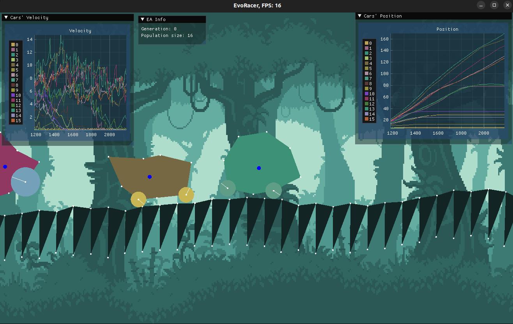
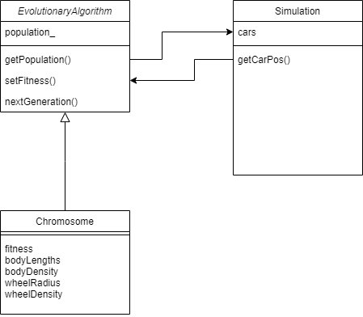

# 🧬 EvoCar: Evolutionary Vehicle Simulation

> A physics-based simulation engine that utilizes **Genetic Algorithms** to evolve optimal 2D vehicle topologies capable of traversing procedurally generated terrain.

## 💡 About The Project

EvoCar is a research application designed to demonstrate the power of evolutionary computation. Instead of manually designing a vehicle to cross rough terrain, the program generates a random population and "evolves" the best design over generations using biological operators.

The car consists of a chassis (skeleton) and two wheels. The simulation leverages **Box2D** for physics and **SFML** for rendering.

### The Genome
Each vehicle is defined by a specific chromosome containing:
* **Wheel Size:** Radius of the two wheels.
* **Chassis Topology:** Vertex distribution of the car's body.
* **Density:** Material density of both the wheels and the chassis.
* **Wheel Density.**

---

## 🌟 Features

### 1. Mutation Observation
Watch the evolution process in real-time. Mutation hyperparameters can be adjusted in `config/EvolutionaryAlgorithmConfig.cc`. You can force the next generation by pressing **"N"**.

### 2. Vehicle Generator
Vehicles are generated based on a specific chromosome. You can tweak:
* Target velocity (`config/CarConfig.cc`).
* Min/Max density and attribute limits (`config/EvolutionaryAlgorithmConfig.cc`).

### 3. Procedural Map Generation
The terrain is generated randomly. You can adjust the minimum and maximum slope changes in the configuration files to make the track harder or easier.

### 4. Evolutionary Engine
We implemented a custom Genetic Algorithm with:
* **Tournament Selection**
* **Gaussian Mutation**
* **Configurable Hyperparameters:** Population size, mutation rate, tournament size (all editable in `config/EvolutionaryAlgorithmConfig.cc`).

### 5. Data Persistence & Analysis
* **Save/Load:** The genome data and results can be saved to external files (Toggle `SAVE_TO_FILE` in `config/Config.cc`).
* **Charts:** Real-time plotting of vehicle speed and current position.

---

## 🏗️ Architecture

The project is structured around the `EvolutionaryAlgorithm` class, which manages the population lifecycle.

* **EvolutionaryAlgorithm:** Handles population initialization (`getPopulation`), fitness evaluation (`setFitness`), and the transition to the next generation (`nextStep`).
* **Shape.h:** Defines the physical structures (Box, Circle, Polygon).

---

## 🛠️ Tech Stack & Dependencies

* **Language:** C++
* **Physics Engine:** Box2D (`libbox2d-dev`)
* **Graphics:** SFML (`libsfml-dev`) & ImGui (`libimgui-dev`)
* **Testing:** Google Test (`libgtest-dev`) & LCOV
* **Build System:** CMake & Make

---

## 🚀 Getting Started

### Prerequisites (Linux/Ubuntu)
You can install all dependencies using the provided script `install_packages.sh`.

    sudo apt-get install build-essential cmake libbox2d-dev libgtest-dev \
    libsfml-dev libimgui-dev libudev-dev libfreetype-dev libxrandr-dev libx11-dev

### Installation & Build

To build the project from source:

    # 1. Clone the repository
    git clone https://github.com/CrustyCracker/EvoCar.git
    cd EvoCar

    # 2. Build the project using the helper script
    sh fresh_build.sh

    # OR build manually:
    mkdir build
    cd build
    cmake ..
    make

### Running the Application

* **Run Simulation:** `./EvoRacer`
* **Run Unit Tests:** `./Test`

---

## 🎮 Controls

| Key | Action |
| :--- | :--- |
| **P** | Pause / Resume simulation |
| **N** | Force skip to the **Next Generation** |
| **Q** | Quit application |

---

## 🧪 Testing & Quality Assurance

The project includes unit tests using **Google Test**. We track code quality using **LCOV**.

To generate a Test Coverage Report:

    # 1. Ensure lcov is installed
    sudo apt-get install lcov

    # 2. Run the coverage script
    sh test_coverage.sh

    # 3. Open the report
    # Open CodeCoverageReport/index.html in your browser.

---

## 📊 Project Scope

This project was developed with a focus on rigorous software engineering practices.

* **Total Development Time:** ~167 hours.
* **Estimated Time:** 118 hours.
* **Scope:** From library selection and architecture design to implementation of physics, genetic algorithms, and data visualization.

## 📬 Contact

Project Link: [https://github.com/CrustyCracker/EvoCar](https://github.com/CrustyCracker/EvoCar)
